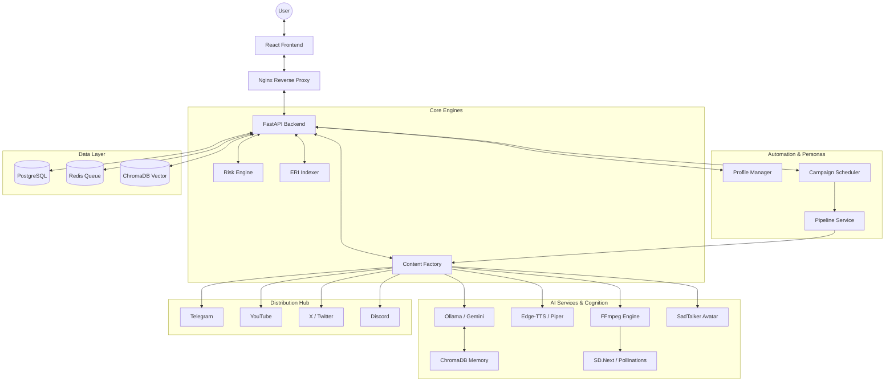

# Geopolitical Intelligence Platform

An academic, modular geopolitical intelligence platform for structured news analysis, risk governance, and high-quality AI content production.

## 🎯 System Overview

This platform is a comprehensive end-to-end intelligence suite that automates the transition from raw data to actionable insights and professional media content.

### Core Capabilities
This platform provides:
- **News Ingestion** from RSS/API sources
- **Entity & Claim Extraction** for intelligence analysis
- **Contradiction Detection** across sources
- **Risk Governance Engine** with 4-dimensional scoring
- **Escalation Risk Index (ERI)** for conflict monitoring
- **Weekly Intelligence Briefs** with PDF export
- **Multi-Platform Distribution**: Automated delivery to Telegram, YouTube, X (Twitter), and Discord.
- **Local-First AI Architecture**: Optimized for Windows DirectML (GPU) with Ollama, SD.Next, and SadTalker.
- **Persona Cognitive Memory**: RAG-enhanced reasoning via local ChromaDB vector database.
- **Autonomous Talking Heads**: 100% free, offline lip-synced video production via SadTalker.

## 🚀 Project Evolution & History

The Geopolitical Intelligence Platform has been built in themed implementation phases to ensure stability and robust AI orchestration:

### Phase 1-6: The Foundation
- **Infrastucture**: Setup of FastAPI, React, PostgreSQL, and Docker.
- **Data Pipeline**: Implemented RSS/API ingestion and primary news fetching.
- **Risk Core**: Developed the 4-dimensional risk scoring model and ERI index.
- **Basic Media**: Initial script generation and simple FFmpeg video rendering.

### Phase 7-8: Open-Source AI Strategy
- **Ollama Integration**: Enabled local LLM support to remove dependency on external API costs.
- **Free TTS Engine**: Integrated Edge-TTS and Piper to provide high-quality narration without subscription fees.
- **Platform Connectors**: Developed distribution services for YouTube, Telegram, and Twitter/X.

### Phase 9: Production Readiness
- **Security**: Implemented Fernet-encrypted storage for all platform API keys.
- **Reliability**: Unified HTTP client logic with custom retry and error handling.
- **Performance**: Optimized Nginx for high-timeout AI and Video rendering tasks (600s+ support).

### Phase 10: Content Factory UI
- **Unified Hub**: Created the **Content Factory** section—a visual orchestration layer for the entire data-to-video pipeline.
- **Self-Healing Auth**: Implemented automatic token refresh to prevent session drops during long operations.

### Phase 11: Premium Video Engine
- **Visual Excellence**: Integrated AI-generated B-roll (image prompts → image retrieval).
- **Social Engagement**: Implemented dynamic synchronized captions and cinematic Ken Burns transitions.
- **Audio Depth**: Added background music mixing and atmospheric overlays.

### Phase 12: Campaign-Based Hyper-Automation (Verified ✅)
- **Persona Blueprints**: Implemented **Profiles** to manage distinct identities (voices, styles, configurations).
- **Autonomous Missions**: Implemented **Campaigns** for hands-free, scheduled content production based on topic interest.
- **Profile-Aware Pipeline**: Created a centralized `PipelineService` that automatically applies persona-specific branding and voice overrides.
- **Autonomous Polling**: Integrated campaign execution into the background scheduler for 24/7 "hands-free" operation.
- **Field Tested**: Successfully verified end-to-end orchestration using Gemini-Flash models and multi-category article routing.

### Phase 13-15: Local GPU Revolution (DirectML & SadTalker)
- **Local AI Optimization**: Configured Ollama with DirectML for 100% private, free reasoning on Windows GPUs (NVIDIA/AMD/Intel).
- **Offline Imagery**: Integrated **SD.Next** for local Stable Diffusion image generation via API.
- **Talking Head Avatars**: Implemented local **SadTalker** driver for realistic lip-syncing, replacing expensive paid APIs.

### Phase 16-18: Intelligence Expansion (RAG & Platform Hub)
- **Cognitive Memory**: Integrated **ChromaDB** for Persona RAG (Retrieval-Augmented Generation). Personas now recall their past analyses to provide deeper, consistent insight.
- **Universal Distribution**: Added native support for **X/Twitter (v2 API)** and **Discord (Webhooks)** distribution.
- **End-to-End Validation**: Created a standalone mission test script to verify the entire local pipeline independently.

## 🏗 Architecture



## 📁 Project Structure

```
geopolitical-intelligence/
├── backend/                    # FastAPI Backend
│   ├── app/
│   │   ├── api/v1/endpoints/   # Unified API Surface (Articles, Auth, Reports, Pipeline, Settings)
│   │   ├── core/               # Security, Encryption, and HTTP Clients
│   │   ├── models/             # Encrypted SQL Models (Automation, Settings, etc.)
│   │   ├── services/           # Business Logic (AI, TTS, Video, Distribution)
│   │   └── migrations/         # Database Evolution Scripts
├── frontend/                   # React + Vite + Tailwind
│   ├── src/
│   │   ├── sections/           # High-level feature modules (Content Factory, ERI, etc.)
│   │   ├── lib/api.ts          # Resilient API client with Auto-Refresh
│   │   └── store/              # Global State (Zustand)
└── docker-compose.yml          # Production-ready orchestration
```

## 📋 Comprehensive Feature Log

### 1. Unified Content Factory
The centerpiece of the platform. A visual dashboard that orchestrates:
- **Fetch**: Category-based multi-source ingestion.
- **Script**: Multi-article synthesis into structured news reports.
- **Voice**: Selection between premium and high-quality free voice engines.
- **Render**: Full FFmpeg composition with dynamic overlays and B-roll.
- **Distribute**: Targeted social media publishing.

### 2. Risk & Governance
- **4D Scoring**: Automated assessment of sensitivity and legal liability.
- **Manual Oversight**: Permission-based approval workflows for editors.
- **Safe Mode**: Global toggle to prevent publication of high-risk content.

### 3. Escalation Risk Index (ERI)
- Real-time heatmaps and time-series monitoring of conflict indicators.
- Weighted scoring across Military, Political, Proxy, Economic, and Diplomatic dimensions.

### 4. Campaign Mission Control (New)
The Phase 12 autonomous engine enables a hands-free intelligence network:
- **Profile Personas**: Define a "Strategic Analyst" or "Regional Reporter" persona with specific voice and video styles.
- **Autonomous Blueprints**: Configure "Campaigns" that monitor specific news categories and regions.
- **Dynamic Scheduling**: Set missions to run Hourly, Daily, or on custom intervals.
- **Automated Pipeline**: The system automatically fetches sources, synthesizes intelligence, generates narration, and renders videos without manual intervention.

## 🛠 Tech Stack

- **Backend**: FastAPI, SQLAlchemy (PostgreSQL), Redis, FFmpeg, Ollama.
- **Frontend**: React 18, Vite, Tailwind CSS, Lucide Icons, Shadcn UI.
- **Infrastructure**: Nginx, Docker, Docker Compose.
- **AI**: Gemini Pro, Ollama (Llama 3.2+), Edge-TTS, Pollinations.ai, SadTalker.
- **Visuals**: SD.Next (Stable Diffusion), DirectML (Windows GPU Acceleration).
- **Cognition**: ChromaDB (Local Vector Store).

## 📖 Detailed Setup Guide

### 🐳 Docker (Recommended)
```bash
# 1. Start the entire stack
docker compose up -d --build

# 2. Access the Platform
# Frontend: http://localhost
# Backend Docs: http://localhost/api/docs
```

### 🐍 Manual Backend Setup
```bash
cd backend
python -m venv venv
source venv/bin/activate
pip install -r requirements.txt
cp .env.example .env # Update with your keys
uvicorn app.main:app --host 0.0.0.0 --port 8000
```

### 🤖 Autonomous Campaign Setup
To initialize the first autonomous profile and mission:
1. **Seed Data**: Run the seeding script inside the backend container to create the "Global Strategic Analyst" profile.
   ```bash
   docker exec geopol-backend python seed_automation.py
   ```
2. **Configure Scheduler**: Ensure `is_active=True` in the database for the desired campaign.
3. **Monitor Autonomy**: Check logs to see the system automatically fetching news and rendering content.
   ```bash
   docker logs geopol-backend -f
   ```

## 🔐 Security & Persistence
- **Encrypted Keys**: All platform API keys (OpenAI, D-ID, etc.) are stored using Fernet encryption in the database.
- **Persistent Output**: The `/output` directory is volume-mounted to ensure media assets persist across container restarts.
- **Immutable Logs**: Audit trails are strictly additive to ensure forensic integrity.

## 🌟 Future Vision: Autonomous Media Network

To transition from a "Content Factory" to a **"Global Intelligence & Media Network"**, the platform is evolving towards full autonomy:

### 1. **Multi-Category Parallel Ingestion**
- Support for **"Always-On"** monitoring across dozens of categories (e.g., Energy Crisis, Middle East Tensions, Tech Rivalry) simultaneously.

### 2. **Social Graph Integration**
- Transitioning from simple distribution to **Engagement-Aware** updates—automatically replying to trending topics within a persona's niche.

### 3. **Autonomous "Hands-Free" Mode**
- Full industrialization of the **Scheduler Blueprint**:
    - AI-managed "Staff" (Personas) running competing news desks.
    - Automated A/B testing of video styles for maximum engagement.
    - Cross-platform synchronization (Thread → Video → Telegram Alert).

---

## 🤝 Project Roadmap
- [x] High-Quality FFmpeg Engine
- [x] Fully Free AI Pipeline
- [x] Multi-Platform Distribution Logic (Telegram, YouTube, Twitter, Discord)
- [x] Local GPU Optimization (DirectML)
- [x] Persona Long-term Memory (RAG)
- [ ] Real-time Graph Visualizer (Neo4j Integration)
- [ ] Advanced Audience Sentiment Analysis

---
*Built for academic and professional geopolitical analysis.*
